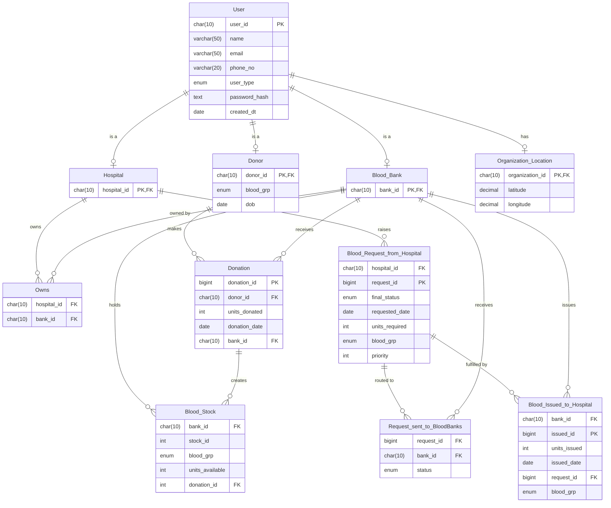

# 🩸 Blood Donation Management System

<p align="center">
  
  
  
  
  
</p>

<p align="center">
  A full-stack web application for managing blood donations, inventory, and hospital requests — with role-based dashboards for Donors, Blood Banks, Hospitals, and Admins.
</p>

<p align="center">
  <a href="#-overview">Overview</a> •
  <a href="#-features">Features</a> •
  <a href="#-tech-stack">Tech Stack</a> •
  <a href="#-architecture">Architecture</a> •
  <a href="#-database-schema">Database</a> •
  <a href="#-getting-started">Getting Started</a> •
  <a href="#-api-routes">API Routes</a> •
  <a href="#-project-structure">Structure</a> •
  <a href="#-contributing">Contributing</a>
</p>

---

## 📌 Overview

The **Blood Donation Management System (BDMS)** is a full-stack web application that digitises and streamlines blood donation workflows. It connects **donors**, **blood banks**, and **hospitals** on a single platform with role-specific dashboards, real-time inventory tracking, and a complete request-fulfillment pipeline.

### ✨ At a Glance

| Role | What They Can Do |
|---|---|
| 🧑 Donor | View profile, track donation history, check eligibility |
| 🏦 Blood Bank | Record donations, manage inventory, fulfill/reject hospital requests |
| 🏥 Hospital | Search nearby blood banks, send blood requests, track request status |
| 🛡️ Admin | System-wide view of users, donations, requests, stock, and issued blood |

---

## 🔧 Features

### 🔐 Authentication & Access Control
- JWT-based authentication with Bearer token in request headers
- Role-based access control via **ID prefix** — user IDs are prefixed with `DNR`, `BNK`, `HSP`, or `ADM` and enforced on every protected route
- **Password reset** using a 30-minute in-memory UUID token (no email service required)
- Protected routes on both frontend (React Router guards) and backend (middleware chain)

### 🧑 Donor
- Profile setup with blood group and date of birth
- **Donation eligibility check** — enforces a 42-day cooldown between donations
- Full donation history with dates and units donated

### 🏦 Blood Bank
- **Add donations** — verifies donor ID, checks eligibility, validates blood group match, and records stock atomically in a single DB transaction
- **Inventory management** — view, adjust, and write off blood stock entries
- **Request handling** — fulfill or reject incoming hospital requests; fulfillment deducts stock transactionally
- Dashboard stats — total donations, pending requests, stock summary
- **Expiry alerting** — stock older than 42 days flagged; low stock threshold at 5 units (configurable via `bloodConfig.js`)

### 🏥 Hospital
- **Find blood banks** — search banks by blood group availability
- **Send blood requests** — specify blood group, units required, and priority
- Multi-bank requests — a single request can be routed to multiple banks simultaneously
- View all active requests and cancel individual bank-level or entire requests
- Hospitals that own a blood bank get a **dual dashboard** — both hospital and bank views

### 🛡️ Admin
- System-wide overview dashboard
- View all registered users, all donations, all requests, full blood stock, and all issued blood records

---

## 🧰 Tech Stack

### Frontend
| Technology | Purpose |
|---|---|
| React 19 | UI framework |
| React Router DOM v7 | Client-side routing with role-protected routes |
| Axios | HTTP client with base URL config |
| Vite 8 | Build tool and dev server |
| Context API | Global auth state (token, role, bankId) |

### Backend
| Technology | Purpose |
|---|---|
| Node.js + Express 5 | REST API server |
| MySQL2 | Database driver with connection pooling (limit: 10) |
| JWT (`jsonwebtoken`) | Stateless authentication |
| bcrypt | Password hashing (salt rounds: 10) |
| uuid v4 | Unique IDs for requests and reset tokens |
| dotenv | Environment variable management |
| cors | Cross-origin requests from frontend (`localhost:5173`) |

---

## 🏛 Architecture

```
┌─────────────────────────────────────┐
│         React Frontend (Vite)       │
│  ┌──────────┐  ┌──────────────────┐ │
│  │AuthContext│  │RoleProtectedRoute│ │
│  └──────────┘  └──────────────────┘ │
│         axios (with JWT header)     │
└──────────────────┬──────────────────┘
                   │ HTTP REST
┌──────────────────▼──────────────────┐
│         Express.js Backend          │
│  ┌────────────────────────────────┐ │
│  │         API Routes             │ │
│  │  /api/auth  /api/donor         │ │
│  │  /api/bloodbank  /api/hospital │ │
│  │  /api/admin  /api/ownedbank    │ │
│  └──────────────┬─────────────────┘ │
│  ┌──────────────▼─────────────────┐ │
│  │        Middleware Chain        │ │
│  │  authMiddleware → roleMiddleware│ │
│  └──────────────┬─────────────────┘ │
│  ┌──────────────▼─────────────────┐ │
│  │         Controllers            │ │
│  └──────────────┬─────────────────┘ │
│  ┌──────────────▼─────────────────┐ │
│  │           Models               │ │
│  │  (SQL queries via mysql2 pool) │ │
│  └──────────────┬─────────────────┘ │
└─────────────────┼───────────────────┘
                  │
┌─────────────────▼───────────────────┐
│            MySQL Database           │
│  User, Donor, Hospital, Blood_Bank  │
│  Donation, Blood_Stock              │
│  Blood_Request_from_hospital        │
│  Requests_sent_to_BloodBanks        │
│  Blood_issued_to_hospital           │
└─────────────────────────────────────┘
```

---

## 🧬 Database Schema

The database (`BDMS`) consists of 9 tables:



| Table | Description |
|---|---|
| `User` | Central user table — all roles share this; ID prefixed `DNR/HSP/BNK/ADM` |
| `Donor` | Donor profile — blood group, date of birth |
| `Hospital` | Hospital profile — linked to User |
| `Blood_Bank` | Blood bank profile — linked to User |
| `Organization_Location` | Lat/long coordinates for banks and hospitals |
| `Owns` | Hospital ↔ Blood Bank ownership mapping |
| `Donation` | Records each donation with donor, bank, units, and date |
| `Blood_Stock` | Per-donation stock entries — units available per blood group per bank |
| `Blood_Request_from_hospital` | Hospital blood requests with priority, blood group, units |
| `Requests_sent_to_BloodBanks` | Per-bank status of each request (`Processing/Approved/Rejected/Cancelled`) |
| `Blood_issued_to_hospital` | Records of blood actually issued to hospitals |

> Run `db.sql` to set up the full schema. For incremental updates, see `backend/migrations/v2_schema.sql`.

---

## 🚀 Getting Started

### Prerequisites

- Node.js (v18+)
- MySQL (v8+)
- npm

### 1. Clone the Repository

```bash
git clone <your-repo-url>
cd Blood-Donation-Management-System
```

### 2. Set Up the Database

```bash
mysql -u root -p < db.sql
```

### 3. Configure the Backend

```bash
cd backend
```

Create a `.env` file (or edit the existing one):

```env
PORT=3000
DB_HOST=localhost
DB_USER=root
DB_PASSWORD=your_password
DB_NAME=BDMS
JWT_SECRET=your_jwt_secret
```

Install dependencies and start:

```bash
npm install
npm start
```

The backend runs on `http://localhost:3000`.

### 4. Start the Frontend

```bash
cd ../frontend
npm install
npm run dev
```

The frontend runs on `http://localhost:5173`.

---

## 📡 API Routes

All protected routes require the header: `Authorization: Bearer <token>`

### Auth — `/api/auth`

| Method | Route | Description |
|---|---|---|
| POST | `/login` | Login and receive JWT |
| POST | `/signup` | Register a new user (donor / hospital / blood_bank / admin) |
| POST | `/forgot-password` | Generate a 30-min password reset token |
| POST | `/reset-password` | Reset password using the token |

### Donor — `/api/donor` *(role: DNR)*

| Method | Route | Description |
|---|---|---|
| GET | `/profile` | Get donor profile |
| GET | `/history` | Get donation history |
| GET | `/lastdt` | Get last donation date |

### Blood Bank — `/api/bloodbank` *(role: BNK)*

| Method | Route | Description |
|---|---|---|
| GET | `/` | Dashboard stats |
| GET | `/inventory` | View blood stock |
| GET | `/requests` | View incoming hospital requests |
| GET | `/donations` | View donation history |
| GET | `/donor/:donor_id` | Check donor eligibility |
| POST | `/donation` | Record a new donation (transactional) |
| POST | `/request/:request_id/fulfill` | Fulfill a request (deducts stock transactionally) |
| POST | `/request/:request_id/reject` | Reject a request |
| PUT | `/inventory/adjust` | Adjust stock units |
| DELETE | `/inventory/:stock_id` | Write off a stock entry |

### Hospital — `/api/hospital` *(role: HSP)*

| Method | Route | Description |
|---|---|---|
| GET | `/dashboard` | Dashboard stats |
| GET | `/find-banks` | Search blood banks by availability |
| GET | `/requests` | View all requests made by this hospital |
| POST | `/send-request` | Send a blood request to one or more banks |
| PUT | `/cancel/:request_id` | Cancel an entire request |
| PUT | `/cancel/:request_id/:bank_id` | Cancel request for a specific bank |

### Admin — `/api/admin` *(role: ADM)*

| Method | Route | Description |
|---|---|---|
| GET | `/dashboard` | System-wide dashboard |
| GET | `/users` | All registered users |
| GET | `/donations` | All donations |
| GET | `/requests` | All blood requests |
| GET | `/stock` | All blood stock |
| GET | `/issued` | All blood issued records |

---

## 📁 Project Structure

```
Blood-Donation-Management-System/
├── db.sql                              # Full MySQL schema
└── backend/
└── frontend/


backend/
├── server.js                           # Express app — mounts all routes
├── .env                                # Environment variables
├── config/
│   ├── db.js                           # MySQL connection pool (limit: 10)
│   └── bloodConfig.js                  # Expiry (42 days), warn threshold (7 days), low stock (5 units)
├── middleware/
│   ├── authMiddleWare.js               # JWT verification
│   ├── roleMiddleWare.js               # Role check via user_id prefix
│   └── ownsBankMiddleware.js           # Verifies hospital owns the bank
├── Routes/                             # Express routers (one per role)
├── controllers/                        # Request handlers — business logic
├── models/                             # SQL query functions (raw mysql2)
└── migrations/
    └── v2_schema.sql                   # Incremental schema migration


frontend/
├── index.html
└── src/
    ├── App.jsx                         # All routes with role guards
    ├── main.jsx                        # App entry with AuthProvider, ToastProvider
    ├── api/
    │   └── axios.js                    # Axios instance with base URL
    ├── context/
    │   ├── AuthContext.jsx             # Global auth state (token, role, bankId)
    │   └── ToastContext.jsx            # Global toast notifications
    ├── components/
    │   ├── Navbar.jsx
    │   ├── Sidebar.jsx
    │   └── Toast.jsx
    ├── routes/
    │   ├── ProtectedRoute.jsx          # Blocks unauthenticated access
    │   └── RoleProtectedRoute.jsx      # Blocks wrong-role access
    └── pages/
        ├── Layouts/
        │   └── DashboardLayout.jsx     # Shared layout wrapper for all dashboards
        ├── auth/                       # Login, Signup, ForgotPassword, ResetPassword
        ├── setup/                      # Profile setup for Donor, Hospital, BloodBank
        └── dashboard/
            ├── UserProfile.jsx
            ├── DashboardRouter.jsx     # Redirects to correct dashboard based on role
            ├── admin/                  # AdminDashboard, Users, Donations, Requests, Stock, Issued
            ├── donor/                  # DonorHome, Profile, History
            ├── hospital/               # HospitalHome, Request, Requests, FindBloodBanks, OwnBank, WithBank
            └── bloodbank/              # BloodBankHome, Inventory, Donations, Requests, AddDonation
                                        # OwnedBankInventory, OwnedBankRequests, OwnedBankDonations
```
---

## 🤝 Contributing

1. Fork the repository
2. Create a new branch: `git checkout -b feature/your-feature`
3. Commit your changes: `git commit -m "Add: short description"`
4. Push and open a Pull Request

---

<p align="center">
  Built with 💙 &nbsp;|&nbsp;
  <a href="<your-repo-url>/issues">Report an Issue</a>
</p>